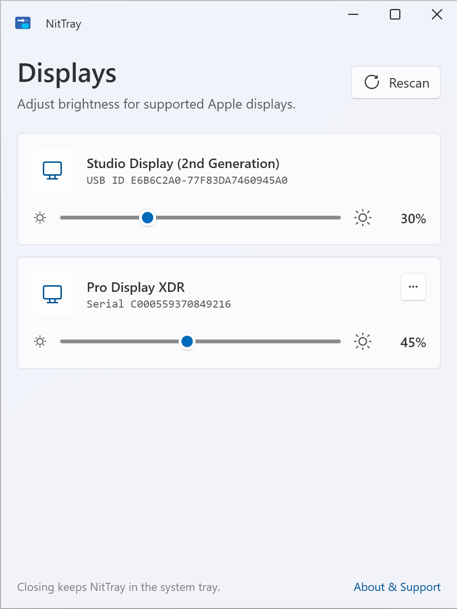
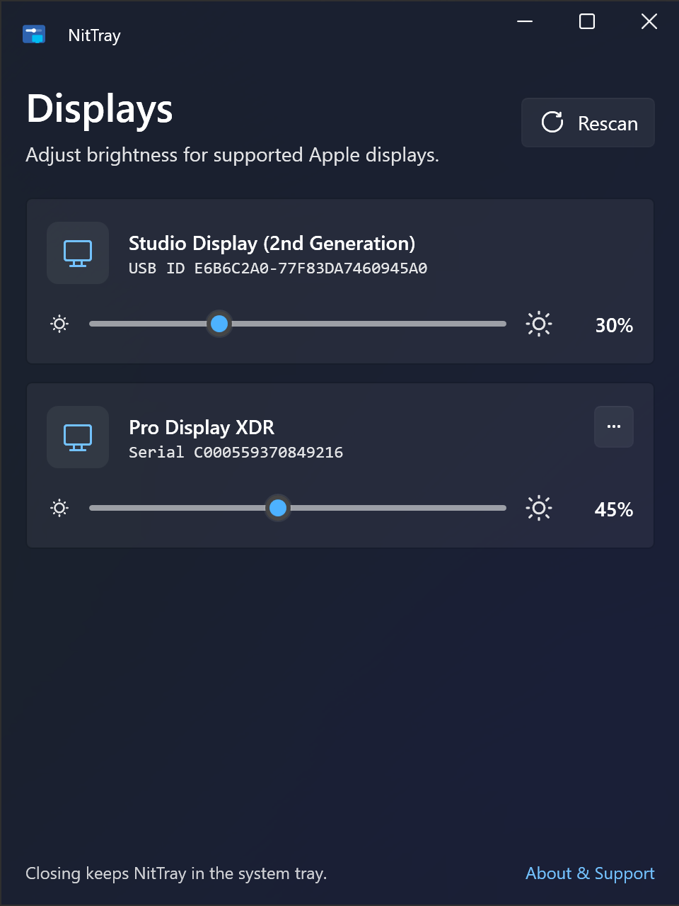

<div align="center">


# NitTray

**Adjust your Apple display's brightness from Windows — right from the system tray.**

[](https://github.com/LinkaiQi/NitTray/releases/latest)

[](https://github.com/LinkaiQi/NitTray/releases/latest)
[](https://github.com/LinkaiQi/NitTray/releases/latest)
[](LICENSE)


&nbsp;&nbsp;


</div>

---

NitTray is a small, free, open-source Windows app that lets you control the
brightness of your **Apple Studio Display** or **Pro Display XDR** — no Mac
required. Plug the display into your Windows PC, drag a slider, done. It lives
quietly in your system tray and talks to the display over the same USB channel
macOS uses, so there's no extra hardware and no monthly anything.

## Supported displays

- Apple **Studio Display** (1st & 2nd generation)
- Apple **Studio Display XDR**
- Apple **Pro Display XDR**

Connect the display to your PC with a **USB-C or Thunderbolt** cable (the same
one that carries the picture).

## Download

**➡️ [Download the latest version](https://github.com/LinkaiQi/NitTray/releases/latest)**

Pick the file that matches your PC — **x64** for most Windows PCs, **arm64** for
Windows on ARM (Snapdragon X, Surface Pro X, and similar):

| File | Best for |
|------|----------|
| **`NitTray-<version>-installer-<arch>.exe`** | Most people. Installs per-user (no admin), adds a Start Menu shortcut and an optional "start when I sign in" option, and can uninstall cleanly. |
| `NitTray-<version>-portable-<arch>.zip` | No install — just unzip and run `NitTray.exe` (keep `NitTray.DriverSetup.exe` next to it). |

> NitTray isn't code-signed yet, so Windows SmartScreen may show a
> *"Windows protected your PC"* notice on first launch. Click **More info → Run
> anyway**. See [troubleshooting](src/app/README.md#troubleshooting).

## Features

- 🖥️ **One slider per display** — every connected Apple display shows up with its
  own brightness slider that updates in real time.
- 🔌 **Auto-detects** displays as you plug and unplug them — no manual refresh.
- 🌗 **Light & dark themes** that follow your Windows setting.
- 🧰 **One-click Pro Display XDR setup** — the XDR needs a one-time driver;
  NitTray installs it for you with a single approval prompt.
- 🪶 **Lightweight & tray-based** — closes to the tray and stays out of your way.
- 🆓 **Free and open source** (GPLv3) — no ads, no tracking, no account.

## How it works

Apple displays don't support the usual monitor controls (DDC/CI). Instead they
accept brightness commands over a USB HID channel — the same one macOS uses
internally. NitTray speaks that protocol directly, with **no admin rights needed**
for everyday brightness control and no kernel drivers. The Pro Display XDR is the
one exception: Windows can't talk to it out of the box, so NitTray does a
one-time WinUSB driver setup for you (a single approval prompt).

Curious about the details — the USB protocol, HID reports, and how displays are
detected? See the [**technical design doc**](src/app/README.md).

## Support the project

If NitTray saves you a trip to the Mac, you can
[**buy me a coffee** ☕](https://buymeacoffee.com/nittray). Totally optional, much
appreciated.

## Building from source

You'll need Windows and the .NET 10 SDK:

```powershell
dotnet run --project src/app
```

Full build, publish, and Pro Display XDR helper instructions are in the
[technical design doc](src/app/README.md#build-and-run).

## License

**GPLv3** — see [`LICENSE`](LICENSE). NitTray bundles
[libwdi](https://github.com/pbatard/libwdi) (LGPLv3/GPLv3) for the Pro Display XDR
driver setup, so the whole project is released under the GPLv3.

## Trademarks

Apple, Studio Display, Pro Display XDR, Mac, and macOS are trademarks of Apple
Inc. NitTray is an independent, unofficial project and is **not** affiliated with,
endorsed by, or sponsored by Apple Inc. Product names are used only to describe
the hardware NitTray works with.
